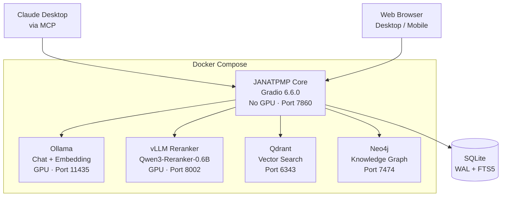

# JANATPMP — Janat Project Management Platform


A **strategic command center** for solo architects and engineers working with AI partners. JANATPMP gives your AI assistants persistent memory — project state, task queues, documents, conversation history, semantic search, and a knowledge graph — all readable and writable via [MCP (Model Context Protocol)](https://modelcontextprotocol.io/). Every message fans out to three stores (SQLite, Qdrant, Neo4j) — the **Triad of Memory**. Conversations become durable, searchable, graph-navigable knowledge. Context survives session boundaries.

Built by and for [The Janat Initiative](https://janatinitiative.org), powering consciousness architecture research across multiple domains.

---

## Architecture

### System Overview


```mermaid
graph TB
    subgraph Docker Compose
        Core[JANATPMP Core<br/>Gradio 6.6.0<br/>No GPU · Port 7860]
        Ollama[Ollama<br/>Chat + Embedding<br/>GPU · Port 11435]
        vLLM[vLLM Reranker<br/>Qwen3-Reranker-0.6B<br/>GPU · Port 8002]
        Qdrant[Qdrant<br/>Vector Search<br/>Port 6343]
        Neo4j[Neo4j<br/>Knowledge Graph<br/>Port 7474]
    end

    SQLite[(SQLite<br/>WAL + FTS5)]
    Core --> SQLite
    Core --> Ollama
    Core --> vLLM
    Core --> Qdrant
    Core --> Neo4j

    Claude[Claude Desktop<br/>via MCP] --> Core
    Browser[Web Browser<br/>Desktop / Mobile] --> Core
```

### Data Flow


```mermaid
graph TB
    MCP[MCP Tools<br/>57 operations] --> DB[db/operations.py<br/>db/chat_operations.py]
    UI[Gradio UI] --> DB
    API[REST API] --> DB
    DB --> SQLite[(SQLite)]
    DB -->|on_write| Qdrant[(Qdrant)]
    DB -->|CDC consumer| Neo4j[(Neo4j)]
    DB -->|on_write| Neo4j
```

Every mutation fans out to three stores via the **triple-write pipeline**: SQLite (source of truth), Qdrant (semantic retrieval via `atlas/on_write.py`), Neo4j (graph navigation via `graph/cdc_consumer.py`). One set of functions serves all surfaces — UI, REST API, and MCP.

---

## Features

- **57 MCP tools** for AI assistant integration (items, tasks, documents, domains, conversations, relationships, vectors, graph, telemetry, ingestion, Janus lifecycle, backups)
- **Triple-write pipeline** — every message fans out to SQLite, Qdrant, and Neo4j synchronously; immediately retrievable on the next turn
- **Knowledge graph** — Neo4j with 7 entity types, CDC consumer for structural edges, INFORMED_BY provenance tracing, SIMILAR_TO cross-conversation linking
- **Janus continuous chat** — one persistent conversation from platform birth, shared across Dashboard sidebar and Sovereign Chat; sliding window sends last N turns to LLM while RAG handles historical context
- **Sovereign Chat** — dedicated chat page (`/chat`) with real-time metrics sidebar: RAG provenance, latency breakdown, token counts, salience scores
- **Multi-provider chat** with triplet message persistence (Anthropic, Gemini, Ollama/local models)
- **Thinking mode** — chain-of-thought captured separately via Ollama `think=True`, stored as `model_reasoning` in triplet schema for future fine-tuning
- **Reasoning token decomposition** — proportional split of completion tokens into reasoning vs response KPIs, even when providers don't report them separately
- **ATLAS two-stage search** — ANN retrieval via Qdrant + cross-encoder reranking via vLLM sidecar with salience write-back
- **Usage-based salience** — keyword overlap heuristic estimates which RAG hits the model actually used, feeding salience boosts/decays back to Qdrant
- **RAG pipeline** — Qwen3-Embedding-4B embeddings (2560-dim, Matryoshka) via Ollama, injected into chat context per-message
- **Cognitive telemetry** — per-turn timing, frozen RAG snapshots, and token counts persisted to `messages_metadata` for longitudinal analysis
- **Slumber Cycle** — 4-stage background daemon (Evaluate, Propagate, Relate, Prune) evaluates quality, bridges quality to Qdrant salience, creates cross-conversation graph edges, and removes dead-weight vectors
- **Content ingestion** — parsers for Claude exports, Google AI Studio, markdown, and text with SHA-256 deduplication
- **Portable project export/import** — versioned JSON export of domains, items, tasks, relationships for surviving platform resets
- **Unified backup/restore** — SQLite + Qdrant snapshots + Neo4j graph export in timestamped directories
- **Dynamic domain management** — domains are first-class database entities, creatable via MCP without code changes
- **Dynamic model discovery** — Ollama models fetched live via `/api/tags`, no hardcoded model lists
- **Project / Task / Document management** with typed relationships and hierarchy
- **Claude conversation import** — ingest Claude export JSON into a searchable triplet schema
- **Full-text search** via SQLite FTS5 across items, documents, and conversation messages
- **Hybrid multipage UI** — monolith dashboard (`/`) with dual collapsible sidebars + Sovereign Chat (`/chat`) via `demo.route()`
- **Auto-context injection** — every chat message receives a live snapshot of active projects and pending tasks
- **Change Data Capture** outbox with background Neo4j sync consumer

---

## Tech Stack

| Component | Technology |
|-----------|-----------|
| Framework | Gradio 6.6.0 (Blocks + multipage routing, MCP server mode) |
| Language | Python 3.14 |
| Database | SQLite (WAL mode, FTS5 full-text search) |
| Vector DB | Qdrant — semantic search over documents and messages (2560-dim cosine) |
| Graph DB | Neo4j 2026.01.4 — knowledge graph with CDC sync + INFORMED_BY provenance |
| Embeddings | Qwen3-Embedding-4B Q4_K_M via Ollama (2560-dim, Matryoshka) |
| Reranking | Qwen3-Reranker-0.6B FP16 via vLLM sidecar (0-1 probability scores) |
| Chat LLM | qwen3-vl:8b (Janus) via Ollama (with thinking mode, 128K context) |
| RAG Synthesizer | qwen3:1.7b via Ollama (knowledge compression) |
| Container | Docker Compose — 5 services: core (no GPU), Ollama (GPU), vLLM (GPU), Qdrant, Neo4j |
| Data Display | Pandas DataFrames |

### GPU Budget (RTX 5090, 32 GB)

| Service | Model | Est. VRAM |
|---------|-------|-----------|
| Ollama — chat | qwen3-vl:8b (Janus) | ~6 GB |
| Ollama — embed | Qwen3-Embedding-4B Q4_K_M | ~2.5 GB |
| Ollama — synth | qwen3:1.7b | ~1.5 GB |
| vLLM — rerank | Qwen3-Reranker-0.6B FP16 | ~1.7 GB |
| **Total** | | **~11.7 GB** |

Core container uses zero GPU — all model inference is offloaded to Ollama and vLLM sidecars.

---

## Quick Start

### Prerequisites

- [Docker](https://docs.docker.com/get-docker/) and Docker Compose
- [NVIDIA Container Toolkit](https://docs.nvidia.com/datacenter/cloud-native/container-toolkit/latest/install-guide.html) (for GPU-accelerated inference)
- A `.env` file with `HF_TOKEN` (for vLLM to download the reranker model from HuggingFace)

### Run

```bash
git clone <repo-url> && cd JANATPMP
docker-compose up --build
```

### Pull Models (first run)

```bash
docker exec janatpmp-ollama ollama pull qwen3-vl:8b
docker exec janatpmp-ollama ollama pull qwen3-embedding:4b-q4_K_M
docker exec janatpmp-ollama ollama pull qwen3:1.7b
```

The vLLM reranker downloads its model automatically on first startup.

Once running:

| Surface | URL |
|---------|-----|
| Dashboard | http://localhost:7860 |
| Sovereign Chat | http://localhost:7860/chat |
| MCP endpoint | http://localhost:7860/gradio_api/mcp/sse |
| API docs | http://localhost:7860/gradio_api/docs |
| Qdrant dashboard | http://localhost:6343/dashboard |
| Neo4j browser | http://localhost:7474 |

The UI is accessible from any device on the same LAN (mobile, tablet, etc.).

### Local Development (no Docker)

```bash
pip install -r requirements.txt
python app.py
```

---

## Project Structure

```
JANATPMP/
├── app.py                     # Orchestrator: init, build_page(), gr.api(), launch
├── janat_theme.py             # Custom Gradio theme (Janat brand colors + CSS)
├── assets/
│   └── janat_logo_bold_transparent.png  # Janat Mandala logo
├── pages/
│   ├── projects.py            # Dashboard UI layout + event wiring
│   └── chat.py                # Sovereign Chat page with metrics sidebar (R11)
├── tabs/
│   ├── tab_database.py        # Admin tab builder
│   ├── tab_chat.py            # Chat handler functions
│   └── tab_knowledge.py       # Knowledge tab handlers
├── shared/
│   ├── constants.py           # Enum lists, magic numbers, defaults
│   ├── formatting.py          # Display helpers (fmt_enum, entity_list_to_df)
│   ├── data_helpers.py        # Data-loading helpers
│   └── chat_service.py        # Cross-page conversation state + config
├── db/
│   ├── schema.sql             # Database DDL
│   ├── operations.py          # 28 CRUD + lifecycle functions
│   ├── chat_operations.py     # Conversation + message + metadata CRUD
│   └── migrations/            # Versioned schema migrations (0.3.0–0.6.0)
├── atlas/                     # ATLAS — HTTP client layer for model services
│   ├── config.py              # Service URLs, model identifiers, Neo4j + salience constants
│   ├── embedding_service.py   # Qwen3-Embedding-4B via Ollama /v1/embeddings
│   ├── reranking_service.py   # Qwen3-Reranker-0.6B via vLLM /v1/score
│   ├── memory_service.py      # Salience write-back to Qdrant (retrieval + usage signals)
│   ├── usage_signal.py        # Keyword overlap heuristic for usage-based salience (R12)
│   ├── on_write.py            # Triple-write: sync embed + fire-and-forget graph edges (R13)
│   └── pipeline.py            # Two-stage search orchestrator
├── graph/                     # Knowledge graph layer — Neo4j (R13)
│   ├── schema.py              # Idempotent Neo4j constraints + indexes
│   ├── graph_service.py       # Neo4j CRUD + MCP tools (query, neighbors, stats)
│   └── cdc_consumer.py        # Background CDC poller + backfill MCP tool
├── services/
│   ├── log_config.py          # SQLite log handler + setup_logging()
│   ├── chat.py                # Multi-provider chat with tool use + thinking mode
│   ├── turn_timer.py          # Thread-local TurnTimer context manager (R12)
│   ├── slumber.py             # Slumber Cycle — 4-stage background daemon (R12+R13)
│   ├── settings.py            # Settings registry with validation
│   ├── claude_import.py       # Claude JSON → triplet messages
│   ├── embedding.py           # Thin shim → atlas/embedding_service.py
│   ├── vector_store.py        # Qdrant ops + two-stage search pipeline
│   ├── bulk_embed.py          # Batch embed via Ollama with checkpointing
│   └── ingestion/             # Content ingestion parsers
├── Dockerfile                 # Python 3.14-slim (no PyTorch, no GPU)
├── docker-compose.yml         # 5-container orchestration
├── Janat_Brand_Guide.md       # Design system (colors, fonts)
└── CLAUDE.md                  # Development guidelines for AI assistants
```

---

## MCP Integration

JANATPMP exposes **57 tools** via [Gradio's MCP server mode](https://www.gradio.app/guides/building-mcp-server-with-gradio). Any MCP-compatible client (Claude Desktop, Claude Code, Cursor, etc.) can connect to:

```
http://localhost:7860/gradio_api/mcp/sse
```

Full API documentation is available at `/gradio_api/docs` while the server is running.

### Tool Categories

| Category | Tools | Examples |
|----------|-------|---------|
| Items | `create_item`, `get_item`, `list_items`, `update_item`, `delete_item`, `search_items` | Projects, features, books — any hierarchical entity |
| Tasks | `create_task`, `get_task`, `list_tasks`, `update_task` | Work queue with assignment, priority, status |
| Documents | `create_document`, `get_document`, `list_documents`, `search_documents` | Session notes, research, artifacts, code |
| Domains | `get_domains`, `get_domain`, `create_domain`, `update_domain` | Organizational categories — database-managed, no code deploys needed |
| Relationships | `create_relationship`, `get_relationships` | Typed connections (blocks, enables, informs, etc.) |
| Conversations | `create_conversation`, `list_conversations`, `search_conversations`, `add_message`, `get_messages`, ... | Chat history with triplet schema |
| Janus | `get_or_create_janus_conversation`, `archive_janus_conversation` | Persistent conversation lifecycle, chapter archiving |
| Telemetry | `add_message_metadata`, `get_message_metadata` | Per-turn timing, RAG snapshots, quality scores |
| Vectors | `vector_search`, `vector_search_all`, `embed_all_documents`, `embed_all_messages`, `embed_all_domains`, `embed_all_items`, `embed_all_tasks`, `recreate_collections` | ATLAS two-stage search, bulk embedding, collection management |
| Graph | `graph_query`, `graph_neighbors`, `graph_stats`, `backfill_graph` | Read-only Cypher queries, node traversal, graph statistics, CDC backfill |
| System | `get_stats`, `get_schema_info`, `backup_database`, `restore_database`, `list_backups`, `reset_database`, `export_platform_data`, `import_platform_data` | Database administration, portable export/import |
| Import | `import_conversations_json`, `import_conversations_directory`, `ingest_google_ai_conversations`, `ingest_markdown_documents` | Claude, Google AI Studio, and markdown ingestion |

All tools are auto-generated from Python docstrings — no separate API definition layer.

---

## UI Layout

### Dashboard (`/`)

```
┌──────────────────────────────────────────────────────────────────────────┐
│  JANATPMP                          [Dashboard]  [Chat]                   │
├──────────────────────────────────────────────────────────────────────────┤
│  [Projects]  [Work]  [Knowledge]  [Admin]           ← Top-level tabs    │
├───────────┬──────────────────────────────────┬────────────────────────────┤
│  LEFT     │     CENTER CONTENT               │  RIGHT                    │
│  SIDEBAR  │                                  │  SIDEBAR                  │
│           │                                  │                           │
│  Context  │  Content changes per tab.        │  Janat Chat (continuous)  │
│  cards    │  Each tab can have sub-tabs      │                           │
│  Filters  │  (Detail / List views, etc.)     │                           │
│  + New    │                                  │                           │
└───────────┴──────────────────────────────────┴────────────────────────────┘
```

### Sovereign Chat (`/chat`)

```
┌──────────────────────────────────────────────────────────────────────────┐
│  JANATPMP                          [Dashboard]  [Chat]                   │
├──────────────┬───────────────────────────────────┬───────────────────────┤
│  LEFT        │     CHATBOT                       │  RIGHT               │
│  SIDEBAR     │                                   │  SIDEBAR             │
│              │     Full-width chatbot             │                      │
│  Chat        │     (Enter = send)                │  Session settings    │
│  Metrics     │                                   │  Provider / Model    │
│  · RAG hits  │     Reasoning in collapsible      │  Temperature / TopP  │
│  · Latency   │     <details> accordions          │  Max tokens          │
│  · Tokens    │                                   │  System instructions │
│  · Salience  │                                   │                      │
└──────────────┴───────────────────────────────────┴───────────────────────┘
```

Both sidebars collapse independently on mobile, leaving center content full-width.

---

## Screenshots

> Screenshots need updating — the current images predate R11's Sovereign Chat redesign.

| View | Screenshot |
|------|-----------|
| Dashboard (Projects) |  |
| Sovereign Chat |  |
| Admin |  |

---

## Database Schema

Ten core tables with FTS5 full-text search and a CDC outbox synced to Neo4j:

- **domains** — First-class organizational entity. 13 seeded domains (5 active, 8 inactive). Managed via MCP — no code deploys needed to add new domains.
- **items** — Projects, features, books, chapters. Hierarchical via `parent_id`. Domain validated against `domains` table.
- **tasks** — Work queue with agent/human assignment, retry logic, cost tracking, acceptance criteria.
- **documents** — Session notes, research, artifacts, conversation imports. FTS5 enabled.
- **relationships** — Universal typed connector between any two entities (items, tasks, documents, conversations).
- **conversations** — Chat sessions from any source (platform, Claude export, imported). Per-session model/provider config.
- **messages** — Triplet schema: `user_prompt` + `model_reasoning` + `model_response`. Designed for fine-tuning data extraction. NULL reasoning = thinking not captured/not applicable.
- **messages_metadata** — Cognitive telemetry companion to messages. Per-turn timing (total/RAG/inference ms), frozen RAG snapshots, keywords, quality scores (0.0-1.0, populated by Slumber Cycle).
- **settings** — Key-value config with base64 obfuscation for secrets.
- **cdc_outbox** — Change Data Capture with background Neo4j sync via CDC consumer daemon.

---

## Development

See [`CLAUDE.md`](CLAUDE.md) for comprehensive development guidelines, including Gradio patterns, state management, and common pitfalls.

### Branch Naming

```
feature/r{N}-{description}    # e.g. feature/r12-cognitive-telemetry
feature/phase{X}-{description}  # legacy naming
```

### Workflow

1. Branch from `main`
2. Develop and test: `docker compose down && docker compose up -d --build`
3. Merge to main, delete feature branch

### Rules

- Never commit directly to `main`
- All `db/operations.py` and `db/chat_operations.py` functions must have full docstrings (Gradio uses them for MCP tool descriptions)
- All UI event listeners must include `api_visibility="private"`

---

## Future

JANATPMP will evolve into a **Nexus Custom Component** within The Nexus Weaver architecture. The **Triad of Memory** (SQLite + Qdrant + Neo4j) is operational, **Janus continuous chat** is live (R14), and every message fans out to all three stores via the triple-write pipeline. Planned next steps:

- **Intelligent intake pipeline** — content-hash-aware incremental sync, freshness detection, automated embedding after ingestion
- **Ollama Modelfiles pipeline** — specialized models (synthesizer, scorer, consolidator, classifier) sharing base weights for dynamic system prompt generation
- **Advanced graph traversal** — multi-hop reasoning across INFORMED_BY and SIMILAR_TO edges
- **Temporal decay curves** — time-weighted salience that naturally deprioritizes stale knowledge

---

## Credits

Built by **Mat Gallagher** — [Janat, LLC](https://janat.org) / [The Janat Initiative](https://janatinitiative.org)

| | |
|---|---|
| UI Framework | [Gradio](https://gradio.app) 6.6.0 |
| Chat LLM | [Ollama](https://ollama.ai) + Qwen3-VL:8B (Janus) |
| Embeddings | [Qwen3-Embedding-4B](https://huggingface.co/Qwen/Qwen3-Embedding-4B) via Ollama |
| Reranking | [Qwen3-Reranker-0.6B](https://huggingface.co/Qwen/Qwen3-Reranker-0.6B) via vLLM |
| Vector Search | [Qdrant](https://qdrant.tech) |
| Knowledge Graph | [Neo4j](https://neo4j.com) 2026.01.4 |
| Persistence | [SQLite](https://sqlite.org) |
