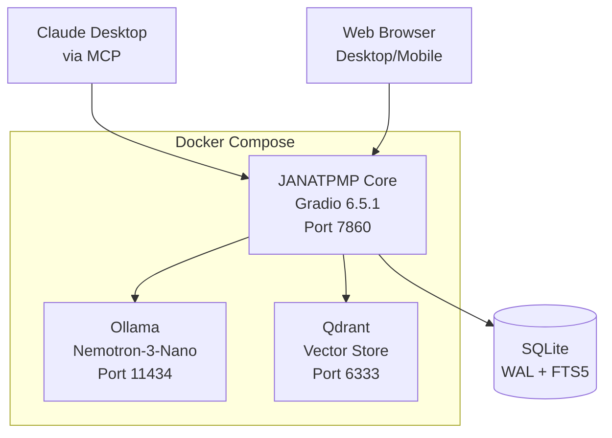
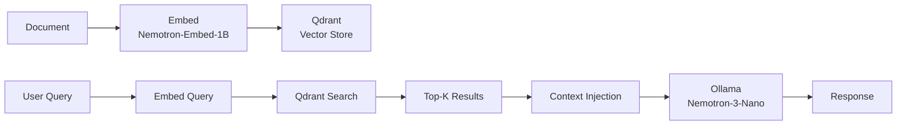
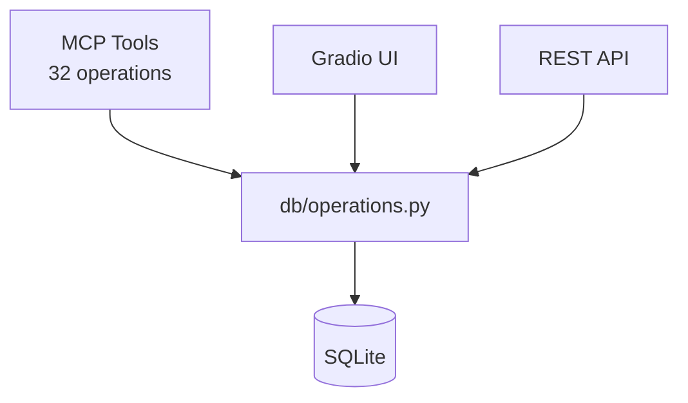

# COWORK TASK: README Overhaul + Documentation Audit

## Context
JANATPMP is being submitted to NVIDIA GTC 2025 contest and Anthropic's "Built with Opus 4.6" competition. The README needs to reflect a professional, well-architected project — not the placeholder stub it currently is.

## Current README (5 lines total — needs complete rewrite)
The current README says "A Gradio-based application for managing codebases" which is inaccurate. JANATPMP is a **project management platform with AI-powered RAG pipeline**.

## Source of Truth
The file `CLAUDE.md` in the same directory contains the comprehensive project documentation. Use it as the primary source for the README rewrite.

## README Structure to Create

### Required Sections:

1. **Title + Badges** — JANATPMP (Janat Project Management Platform)
   - Python 3.14, Gradio 6.5.1, SQLite, Qdrant, NVIDIA Nemotron
   - Include badge placeholders if you can't generate actual shields.io badges

2. **One-paragraph description** — What it is and why it exists
   - Solo architect's command center for consciousness physics research
   - Persistent state for AI assistant collaboration via MCP
   - Built for the GTC 2025 / Anthropic "Built with Opus 4.6" competitions

3. **Architecture Diagram** — Create a Mermaid diagram showing:
   - JANATPMP (Gradio) → Ollama (inference) → Qdrant (vectors) → SQLite (persistence)
   - MCP tool exposure for Claude Desktop / AI assistants
   - If you cannot render Mermaid, write the mermaid code block and add a TODO comment: `<!-- TODO: Render this Mermaid diagram as PNG and embed -->`

4. **Features** — Key capabilities
   - 32+ MCP tools for AI assistant integration
   - Multi-provider chat (Anthropic, Gemini, Ollama/local)
   - RAG pipeline with NVIDIA Nemotron embedding
   - Project/Task/Document management with relationships
   - Claude conversation import (603 conversations, triplet schema)
   - Full-text search (FTS5) + semantic search (Qdrant)
   - Single-page responsive UI with dual collapsible sidebars

5. **Tech Stack** — table format
   | Component | Technology |
   |-----------|-----------|
   | Framework | Gradio 6.5.1 |
   | Language | Python 3.14 |
   | Database | SQLite (WAL, FTS5) |
   | Vector Store | Qdrant |
   | Inference | Ollama + Nemotron-3-Nano |
   | Embedding | nvidia/llama-nemotron-embed-1b-v2 |
   | Container | Docker Compose |

6. **Quick Start** — docker-compose up steps
   - Prerequisites: Docker, NVIDIA Container Toolkit, GPU
   - Three commands to get running
   - MCP endpoint URL

7. **Project Structure** — simplified tree (from CLAUDE.md)

8. **MCP Integration** — How AI assistants connect
   - Endpoint: `http://localhost:7860/gradio_api/mcp/sse`
   - Brief description of available tool categories

9. **Screenshots** — Reference the existing screenshots in `/screenshots/`
   - Add `<!-- TODO: Add updated screenshots -->` if current ones are outdated

10. **Development** — How to contribute/develop
    - Branch naming convention
    - Commit message format
    - Reference CLAUDE.md for full development guidelines

11. **License** — Add a placeholder: `<!-- TODO: Determine license -->`

12. **Credits / Built With** — 
    - Anthropic Claude (architecture partner)
    - NVIDIA Nemotron (inference + embedding)
    - Gradio (UI framework)
    - Janat, LLC / The Janat Initiative Research Institute

### Diagrams to Create (Mermaid)

**1. System Architecture:**

**2. RAG Pipeline:**

**3. Data Flow (MCP):**

If Mermaid rendering is not possible, include the code blocks with TODO markers for manual rendering.

## Documentation Audit

While rewriting the README, also review:

1. **CLAUDE.md** — Is it current? Flag any sections that seem outdated with `<!-- REVIEW: ... -->`
2. **docs/INVENTORY.md** — Does it exist and is it useful?
3. **pyproject.toml** — Does it have proper metadata (name, version, description, author)?
4. **Janat_Brand_Guide.md** — Referenced anywhere useful?

## Output
- Rewritten `README.md` in the project root
- Any TODO/REVIEW comments inline for items that need manual follow-up
- If diagrams can't be rendered, the mermaid source code is still valuable

## Do NOT
- Modify any Python code
- Change the project structure
- Delete any existing files
- Make claims about features that don't exist yet (check CLAUDE.md for current status)
