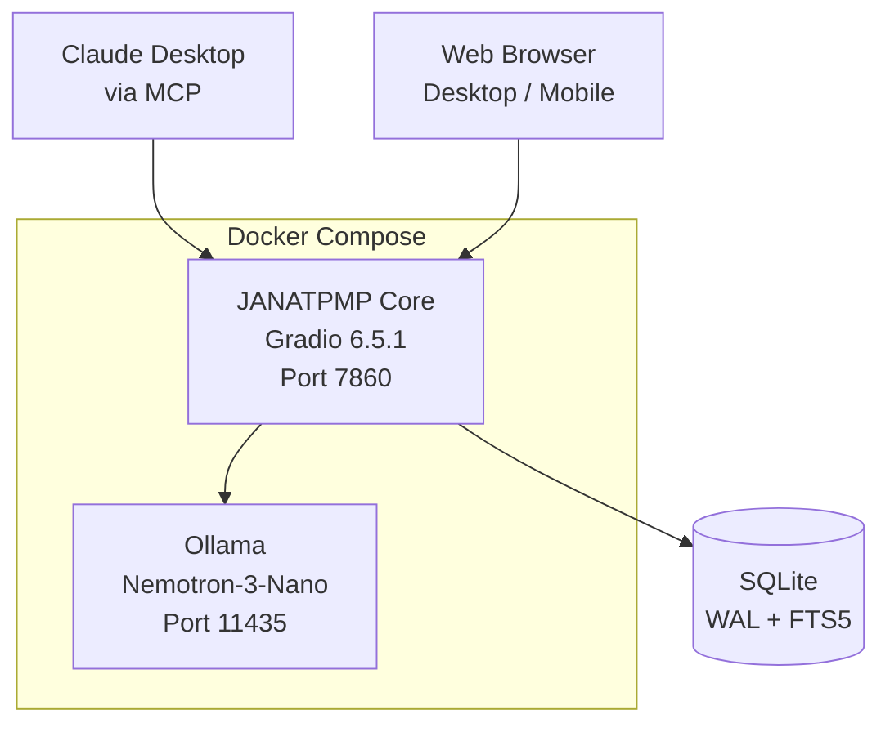
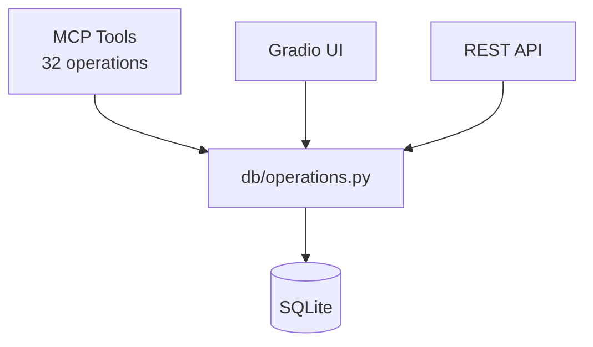

# JANATPMP — Janat Project Management Platform


<!-- TODO: Replace badge placeholders with actual shields.io URLs once repo is public -->

A **strategic command center** for solo architects and engineers working with AI partners. JANATPMP provides persistent project state that AI assistants can read and write via [MCP (Model Context Protocol)](https://modelcontextprotocol.io/), turning conversations into durable, searchable knowledge. Built for the Anthropic "Built with Opus 4.6" competition (Feb 2026), it powers the consciousness architecture research behind [The Janat Initiative](https://janatinitiative.org).

---

## Architecture

### System Overview


<!-- TODO: Render this Mermaid diagram as PNG and embed for GitHub preview -->

### Data Flow



One set of functions in `db/operations.py` serves all three surfaces — UI event listeners, REST API, and MCP tool generation — ensuring a single source of truth for every operation.

---

## Features

- **32 MCP tools** for AI assistant integration (items, tasks, documents, conversations, relationships, settings, backups)
- **Multi-provider chat** with triplet message persistence (Anthropic, Gemini, Ollama/local models)
- **Project / Task / Document management** with typed relationships and hierarchy
- **Claude conversation import** — ingest Claude export JSON into a searchable triplet schema
- **Full-text search** via SQLite FTS5 across items, documents, and conversation messages
- **Single-page responsive UI** with dual collapsible sidebars (mobile-friendly via `gr.Sidebar`)
- **Auto-context injection** — every chat message receives a live snapshot of active projects and pending tasks
- **Change Data Capture** outbox for future vector/graph sync (Qdrant, Neo4j)

---

## Tech Stack

| Component | Technology |
|-----------|-----------|
| Framework | Gradio 6.5.1 (Blocks, MCP server mode) |
| Language | Python 3.14 |
| Database | SQLite (WAL mode, FTS5 full-text search) |
| Inference | Ollama — Nemotron-3-Nano (default), DeepSeek-R1, Qwen3, Phi-4 |
| Container | Docker Compose (Python 3.14-slim + NVIDIA GPU passthrough) |
| Data Display | Pandas DataFrames |

---

## Quick Start

### Prerequisites

- [Docker](https://docs.docker.com/get-docker/) and Docker Compose
- [NVIDIA Container Toolkit](https://docs.nvidia.com/datacenter/cloud-native/container-toolkit/latest/install-guide.html) (for GPU-accelerated inference)

### Run

```bash
git clone <repo-url> && cd JANATPMP
docker-compose up --build
```

Once running:

| Surface | URL |
|---------|-----|
| Web UI | http://localhost:7860 |
| MCP endpoint | http://localhost:7860/gradio_api/mcp/sse |
| API docs | http://localhost:7860/gradio_api/docs |

The UI is accessible from any device on the same LAN (mobile, tablet, etc.).

### Local Development (no Docker)

```bash
pip install -r requirements.txt
python app.py
```

---

## Project Structure

```
JANATPMP/
├── app.py                     # Thin orchestrator: init_database(), build_page(), gr.api(), launch
├── pages/
│   └── projects.py            # All UI construction: build_page()
├── tabs/
│   └── tab_database.py        # Admin tab builder (imported by projects.py)
├── db/
│   ├── schema.sql             # Database DDL (no seed data)
│   ├── seed_data.sql          # Optional seed data (separate from schema)
│   ├── operations.py          # 22 CRUD + lifecycle functions (Items, Tasks, Docs, Relationships, Settings, Backups)
│   ├── chat_operations.py     # 10 conversation + message operations
│   ├── test_operations.py     # Tests
│   ├── migrations/            # Versioned schema migrations
│   └── backups/               # Timestamped database backups
├── services/
│   ├── chat.py                # Multi-provider chat with tool use
│   ├── claude_export.py       # Claude Export ingestion service
│   └── settings.py            # Key-value settings with base64 secret obfuscation
├── screenshots/               # UI screenshots
├── docs/                      # Design docs and mockups
├── completed/                 # Archived phase TODOs
├── requirements.txt           # Pinned dependencies
├── pyproject.toml             # Project metadata
├── Dockerfile                 # Python 3.14-slim image
├── docker-compose.yml         # Multi-container orchestration
├── Janat_Brand_Guide.md       # Design system (colors, fonts)
└── CLAUDE.md                  # Full development guidelines for AI assistants
```

---

## MCP Integration

JANATPMP exposes **32 tools** via [Gradio's MCP server mode](https://www.gradio.app/guides/building-mcp-server-with-gradio). Any MCP-compatible client (Claude Desktop, Claude Code, Cowork, etc.) can connect to:

```
http://localhost:7860/gradio_api/mcp/sse
```

### Tool Categories

| Category | Tools | Examples |
|----------|-------|---------|
| Items | `create_item`, `get_item`, `list_items`, `update_item`, `delete_item`, `search_items` | Projects, features, books — any hierarchical entity |
| Tasks | `create_task`, `get_task`, `list_tasks`, `update_task` | Work queue with assignment, priority, status |
| Documents | `create_document`, `get_document`, `list_documents`, `search_documents` | Session notes, research, artifacts, code |
| Relationships | `create_relationship`, `get_relationships` | Typed connections (blocks, enables, informs, etc.) |
| Conversations | `create_conversation`, `list_conversations`, `search_conversations`, `add_message`, `get_messages`, ... | Chat history with triplet schema |
| System | `get_stats`, `get_schema_info`, `backup_database`, `restore_database`, `list_backups`, `reset_database` | Database administration |

All tools are auto-generated from Python docstrings — no separate API definition layer.

---

## UI Layout

```
┌──────────────────────────────────────────────────────────────────────────┐
│  [Projects]  [Work]  [Knowledge]  [Chat]  [Admin]    ← Top-level tabs  │
├───────────┬──────────────────────────────────┬────────────────────────────┤
│  LEFT     │     CENTER CONTENT               │  RIGHT                    │
│  SIDEBAR  │                                  │  SIDEBAR                  │
│           │  Content changes per tab.        │                           │
│  Context  │  Each tab can have sub-tabs      │  Claude Chat (default)    │
│  cards    │  (Detail / List views, etc.)     │  OR Chat Settings         │
│  Filters  │                                  │  (when Chat tab active)   │
│  + New    │                                  │                           │
└───────────┴──────────────────────────────────┴────────────────────────────┘
```

Both sidebars collapse independently on mobile, leaving center content full-width.

---

## Screenshots

<!-- TODO: Add updated screenshots reflecting current UI -->

| View | Screenshot |
|------|-----------|
| Projects tab |  |
| Chat tab |  |

---

## Database Schema

Seven core tables with FTS5 full-text search and a CDC outbox for future sync:

- **items** — Projects, features, books, chapters. Hierarchical via `parent_id`. 12 domain categories.
- **tasks** — Work queue with agent/human assignment, retry logic, cost tracking, acceptance criteria.
- **documents** — Session notes, research, artifacts, conversation imports. FTS5 enabled.
- **relationships** — Universal typed connector between any two entities (items, tasks, documents, conversations).
- **conversations** — Chat sessions from any source (platform, Claude export, imported). Per-session model/provider config.
- **messages** — Triplet schema: `user_prompt` + `model_reasoning` + `model_response`. Designed for fine-tuning data extraction.
- **settings** — Key-value config with base64 obfuscation for secrets.
- **cdc_outbox** — Change Data Capture for future Qdrant/Neo4j synchronization.

---

## Development

See [`CLAUDE.md`](CLAUDE.md) for comprehensive development guidelines, including Gradio patterns, state management, and common pitfalls.

### Branch Naming

```
feature/phase{version}-{description}
```

### Commit Format

```
Phase {version}: {one-line summary}
```

### Workflow

1. Branch from `main` → `feature/phase{X}-{name}`
2. Develop and test: `docker compose down && docker compose up -d --build`
3. Merge to main, delete feature branch
4. Move completed TODO to `completed/`

### Rules

- Never commit directly to `main`
- One phase = one branch = one merge
- All `db/operations.py` functions must have full docstrings (Gradio uses them for MCP tool descriptions)
- All UI event listeners must include `api_visibility="private"`

---

## Future Roadmap

JANATPMP will evolve into a **Nexus Custom Component** within The Nexus Weaver architecture. Planned integrations:

- **Qdrant** — Semantic vector search over documents and conversations
- **Neo4j** — Graph database for entity relationship traversal
- **NVIDIA Nemotron embedding** (`nvidia/llama-nemotron-embed-1b-v2`) for RAG pipeline

Together these form the **Triad of Memory** (SQL + Vector + Graph). The CDC outbox table already provides forward-compatibility for this evolution.

---

## Credits

Built by **Mat Gallagher** — [Janat, LLC](https://janat.org) / [The Janat Initiative Research Institute](https://janatinitiative.org)

| | |
|---|---|
| Architecture Partner | [Anthropic Claude](https://claude.ai) (Opus 4.6) |
| UI Framework | [Gradio](https://gradio.app) 6.5.1 |
| Local Inference | [Ollama](https://ollama.ai) + NVIDIA Nemotron |
| Persistence | [SQLite](https://sqlite.org) |

<!-- TODO: Determine license -->
